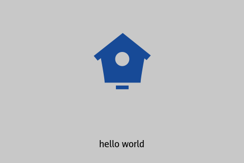

# gui2image
A renderer that rendering gui controls to image

## Install

```bash
go get github.com/lonord/gui2image
```

## Example

```go
// use Paper as root control
rootControl := &Paper{
	Control: Control{Background: color.RGBA{200, 200, 200, 255}, Bounds: image.Rect(0, 0, 480, 320)},
}
// add a ImageView
f, err := os.Open(filepath.Join("testdata", "TestRenderImageView.Input.png"))
if err != nil {
	t.Fatal(err)
}
imgIn, err := png.Decode(f)
if err != nil {
	t.Fatal(err)
}
imgView := &ImageView{
	Control: Control{Background: color.RGBA{200, 200, 200, 255}, Bounds: image.Rect(140, 20, 340, 220)},
	Img:     imgIn,
}
rootControl.AddSub(imgView)
// add a Label
label := &Label{
	Control:   Control{Background: color.RGBA{200, 200, 200, 255}, Bounds: image.Rect(0, 240, 480, 320)},
	Text:      "hello world",
	FontSize:  18,
	TextColor: color.Black,
	HAlign:    AlignCenter,
	VAlign:    AlignCenter,
}
rootControl.AddSub(label)
// render
img := rootControl.Image()   // img is the output image
```

And output image is:



## License
MIT
